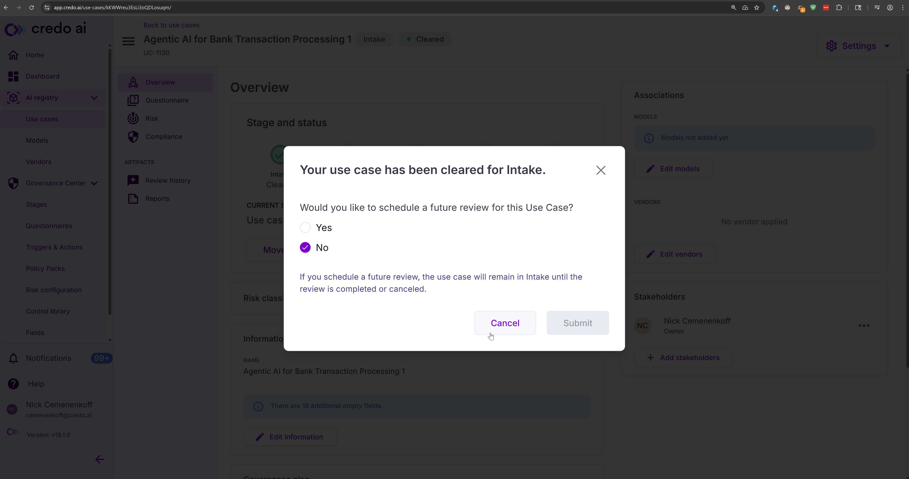

<!-- omit in toc -->
# Webhooks Testing Guide
Before deploying webhooks in production, it's important to validate that they are working correctly. This guide walks you through how to test your webhook configuration using a temporary test endpoint or your own event server.

<!-- omit in toc -->
## Table of Contents
<!-- TOC start (generated with https://github.com/derlin/bitdowntoc) -->

- [1. Configure a Test Endpoint](#1-configure-a-test-endpoint)
- [2. Create Your Webhook](#2-create-your-webhook)
- [3. Trigger an Event](#3-trigger-an-event)
  - [3.1 Example Review Status Update Trigger](#31-example-review-status-update-trigger)
- [4. View Results](#4-view-results)
  - [4.1 Request Summary](#41-request-summary)
  - [4.2 Request Headers](#42-request-headers)
  - [4.3 Request Body](#43-request-body)

<!-- TOC end -->

---

<!-- TOC --><a name="1-configure-a-test-endpoint"></a>
## 1. Configure a Test Endpoint

> **Note:** If you already have an event server available, skip to [Step 2](#2-create-your-webhook) and use that server’s URL.

Otherwise, use [Svix Playground](https://app.svix.com/play) to spin up a temporary endpoint:

1. Visit [Svix Playground](https://app.svix.com/play).

2. Click **Start Now**.

   

3. **Bookmark** the page and **copy the endpoint URL**.

   You'll use this URL when creating your webhook in Step 2.

   

<!-- TOC --><a name="2-create-your-webhook"></a>
## 2. Create Your Webhook

Using the URL from Step 1 (or your existing event server), create a webhook via the [Credo AI API](https://knowledge.credo.ai/webhooks):

* Authenticate using your API token.
* Set the appropriate `authentication_method`:

  * Use `"none"` for Svix Playground.
  * Use your real settings for a production event server.
* Use any valid event type; we recommend starting with:

  ```
  use_case_review_status_updated
  ```

<!-- TOC --><a name="3-trigger-an-event"></a>
## 3. Trigger an Event

To test the webhook:

1. Navigate to a **Use Case** in the Credo AI UI.
2. Click the **Submit for review** and complete the form.
3. Click **Complete review** and complete the form.

This should trigger the `use_case_review_status_updated` event.

<!-- TOC --><a name="31-example-review-status-update-trigger"></a>
### 3.1 Example Review Status Update Trigger





<!-- TOC --><a name="4-view-results"></a>
## 4. View Results

Depending on the method you used:

* If you're using your **own event server**, confirm the incoming message was received correctly
* If you're using **Svix Playground**, go back to the URL you bookmarked in Step 1

You should see new messages listed in the top-left pane. Click on a message to inspect the payload.


<!-- TOC --><a name="41-request-summary"></a>
### 4.1 Request Summary

| Field        | Value                                       |
| ------------ | ------------------------------------------- |
| **URL**      | `/api/v1/in/e_2dRo5Czka1mlhc5J1kr1KZrv4Bp/` |
| **Method**   | `POST`                                      |
| **Date**     | August 7, 2025 at 10:56 PM                  |
| **IP**       | `52.35.32.203`                              |
| **Response** | `204 No Content`                            |

<!-- TOC --><a name="42-request-headers"></a>
### 4.2 Request Headers

| Header           | Value                                             |
| ---------------- | ------------------------------------------------- |
| `Accept`         | `*/*`                                             |
| `Content-Length` | `465`                                             |
| `Content-Type`   | `application/json`                                |
| `Svix-Id`        | `msg_30zZvVW6oyBt1dtsz9qpdjzqG8m`                 |
| `Svix-Signature` | `v1,zP/iGdaSlAWQ3sj1nfut7nzm/bEGtV4UkgRYiNZ76rU=` |
| `Svix-Timestamp` | `1754632592`                                      |
| `User-Agent`     | `Svix-Webhooks/1.23.0`                            |

<!-- TOC --><a name="43-request-body"></a>
### 4.3 Request Body

```json
{
  "data": {
    "status": "in_progress",
    "user": {
      "email": "cemenenkoff@credo.ai",
      "role": "admin",
      "job": null,
      "userId": "YNYykoSUOcXtTtHCrsmbyE",
      "nickname": "Nick",
      "familyName": "Cemenenkoff",
      "givenName": "Nick"
    },
    "eventType": "use_case_review_status_updated",
    "useCaseId": "SefqMYk3TSqe6rK7Lg7YZ",
    "reviewId": "L7BNwLapiuMQVNewuS49N"
  },
  "type": "CredoAI.use_case_review_status_updated.v1",
  "time": "2025-08-07T05:56:32.136590Z",
  "source": "CredoAI",
  "subject": "use_case_review_status_updated"
}
```